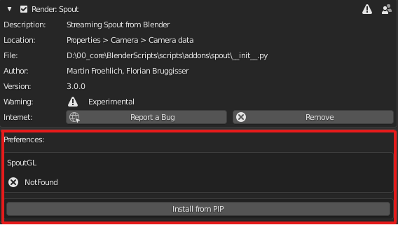
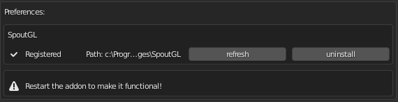
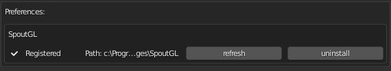

# pip importer for blender addons

**pip_importer.py** helps you to import python packages for your addon.

This works only for addons with their own folder

## Installation

Drop **pip_importer.py** into you addon folder

## Usage

You need to adjust your __init__.py file accordingly:

### First you need to import the pip_importer

    from . import (
        pip_importer,
    )

### Then inside the register() function you register the pip_importer

    def register():
        # First startup the pip importer
        pip_importer.register()

### Then you add as many pip_importer.add_package() calls as necessary. Yes, you can manage as many pip packages as you desire.

        # then add the required packages
        if platform.system() == "Windows":
            pip_importer.add_package(pip_importer.Package("SpoutGL", version="==0.0.4"))

        if platform.system() == "Darwin":  
            pip_importer.add_package(pip_importer.Package("syphonpy", version="==0.0.2"))

#### Following syntax is valid:

    pip_importer.Package("SpoutGL")
    pip_importer.Package("SpoutGL", version=">=0.0.3")
    pip_importer.Package("SpoutGL", version="==0.0.4")
    pip_importer.Package("SpoutGL", "SpoutGL", version="==0.0.4")

### You then can force the addon to try to install the packages automatically (not recomended)

        # pip_importer.auto_install_packages()

### Then you check if the required modules are available

        # Check required modules availability
        try:
            pip_importer.check_modules()

#### only now you import your other libraries that require the existence of the pip packages

            from . import operators, ui
            operators.register()
            ui.register()
        except ModuleNotFoundError:
            print("Spout addon isn't available!")

#### and at the end the required cleanup

    def unregister():
        try:
            operators.unregister()
            ui.unregister()
        except Exception:
            pass

        pip_importer.unregister()

    if __name__ == "__main__":
        register()

## Experience for the user

When the addon is enabled for the first time, the user will be asked to install the required packages:

once the packages are successfully installed, the user will get the follwing

once the addon is restarted, the addon is ready to use:

## Credits

created by IASpace, Zürich University of the Arts, Switzerland.

* [Martin Froehlich](https://github.com/maybites)

### Special Thanks:
[CAD_Sketcher](https://github.com/hlorus/CAD_Sketcher) got me started. Hurray to Opensource!

Python support by [Florian Bruggisser](https://github.com/cansik)
